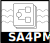

# Streaming Analytics for Process Mining - 2021

	

		
Streaming Analytics for Process Mining

		
To be held in conjunction with ICPM 2021. November 1, 2021 - Eindhoven, The Netherlands

	

	

		Antepali, CC BY-SA 4.0, via Wikimedia Commons
	

	

## Scope

Streaming Process Mining is an emerging area in process mining that spans data mining (e.g. stream data mining; mining time series; evolving graph mining), process mining (e.g. process discovery; conformance checking; predictive analytics; efficient mining of big log data; online feature selection; online outlier detection; concept drift detection; online recommender systems for processes), scalable big data solutions for process mining and the general scope of online event mining. In addition to many other techniques that are all gaining interest and importance in industry and academia.

The SA4PM workshop aims at promoting the use and the development of new techniques to support the analysis of streaming-based processes. We aim at bringing together practitioners and researchers from different communities, e.g. Process Mining, Stream Data Mining, Case Management, Business Process Management, Database Systems and Information Systems who share an interest in online analysis and optimization of business processes and process-aware information systems with time, storage or complexity restrictions. Additionally, SA4PM aims at attracting research results on scalable algorithmic process mining solutions in general given that the work addresses how would such efficient solution function under streaming settings. The workshop aims at discussing the current state of ongoing research and sharing practical experiences, exchanging ideas and setting up future research directions.

The list of topics that are relevant to the SA4PM workshop includes, but is not limited to:

* Novel Algorithms for Stream-Based Process Discovery
* Novel Algorithms for Stream-Based Conformance Checking
* Novel Algorithms for Stream-Based Compliance Checking
* Online Predictive Analytics
* Online Recommender Systems
* Online Case-Adaptation Techniques
* Online Decision Mining
* Online Recommender Systems for Processes
* Real-Time Process Mining
* Online Concept Drift Detection
* Online Outlier Detection
* Solutions for Process Mining & Big Data
* Streaming Feature Selection Methods for High-Dimensional Log Files
* Streaming Trace Clustering Methods
* Architectures for Distributed Process Mining (from algorithmic perspective)
* Architectures for Distributed Storage of Event Data
* Adoption of Process Mining in Scalable Big Data/Streaming Solution (e.g. Apache Hadoop/Spark)
* Evaluation Methods of Streaming Process Mining Algorithms
* Visualization Methods for Streaming Process Mining Results
* Applications/Case-Studies of the Application of Online Process Mining
* Process Monitoring
* Online Event Mining
* Graph Evolution Mining Methods for Process Mining
* Time Series Mining Methods for Process Mining
* Methodological Aspects of Online Process Mining
* Fundamental Aspects of Online Process Mining.

The workshop is a satellite event of the IEEE Task Force on Process Mining.

## Proceedings

The proceedings of the workshops will be published together with the other ICPM workshops as conference proceedings by Springer-Verlag in its Lecture Notes in Business Information Systems (LNBIP) series.

## Organization

### Organizers

* Marwan Hassani, Eindhoven University of Technology, <m.hassani@tue.nl>
* Andrea Burattin, Technical University of Denmark, <andbur@dtu.dk>
* Thomas Seidl, Ludwig-Maximilians-Universität München, <seidl@dbs.ifi.lmu.de>
* Sebastiaan van Zelst, Fraunhofer Institute for Applied Information Technology, <s.j.v.zelst@pads.rwth-aachen.de>

### Program Committee

* Agnes Koschmider, Kiel University, Germany
* Ahmed Awad, University of Tartu, Estonia
* Eric Verbeek, Eindhoven University of Technology, The Netherlands
* Felix Mannhardt, Eindhoven University of Technology, The Netherlands
* Florian Richter, Ludwig-Maximilians-Universität München, Germany
* Francesco Folino, ICAR -CNR, Italy
* Frederic Stahl, German Research Center for Artificial Intelligence (DFKI), Germany
* Jochen De Weerdt, KU Leuven, Belgium
* Matthias Weidlich, Humboldt-Universität zu Berlin, Germany
* Marco Comuzzi, UNIST, Korea
