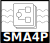
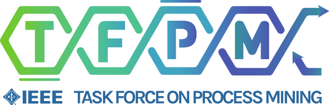

# Stream Management & Analytics for Process Mining - 2025

	

		
Stream Management & Analytics for Process Mining

		
To be held in conjunction with ICPM 2025. October 20, 2025 - Montevideo, Uruguay

	

	

		Image from https://planmyweekend.ai/10-inspiring-year-round-experiences-and-things-to-do-in-montevideo-uruguay/
	

	

!!! info "Outcome of the workshop"

    Alongside the scientific papers, during the workshop we had two discussion sessions. The minutes have been summarized in a shared document which is available at [https://doi.org/10.5281/zenodo.20537926](https://doi.org/10.5281/zenodo.20537926).

## Scope

Streaming Process Mining is an emerging area in process mining that spans data mining (e.g. stream data mining; mining time series; evolving graph mining), process mining (e.g. process discovery; conformance checking; predictive analytics; efficient mining of big log data; online feature selection; online outlier detection; concept drift detection; online recommender systems for processes), scalable big data solutions for process mining and the general scope of online event mining. In addition to many other techniques that are all gaining interest and importance in industry and academia.

Recently, event streams are gaining attention in the process management and mining community not only for analytics but also for the management and orchestration of business processes. Examples are online event correlation as a preprocessing step for online process mining, using flexible rule-based event consumption and generation for enacting process instances, and decentralized process execution.

After a very successful four runs on this workshop together with ICPM 2020 - ICPM 2024, this workshop aims at further promoting the use and the development of new techniques to support the analysis of streaming- based processes. We aim at bringing together practitioners and researchers from different communities, e.g. Process Mining, Stream Data Mining, Case Management, Business Process Management, Database Systems and Information Systems who share an interest in online analysis and optimization of business processes and process-aware information systems with time, storage or complexity restrictions. The workshop aims at discussing the current state of ongoing research and sharing practical experiences, exchanging ideas and setting up future research directions.

The list of topics that are relevant to the SA4PM workshop includes, but is not limited to:

* Novel Algorithms for Stream-Based Process Discovery
* Novel Algorithms for Stream-Based Conformance Checking
* Novel Algorithms for Stream-Based Compliance Checking
* Novel Approaches for Stream-based Event Correlation for Process Mining
* Succinct data structures and data sketches for online process mining
* Online Predictive Analytics
* Online Recommender Systems
* Online Case-Adaptation Techniques
* Online Decision Mining
* Online Recommender Systems for Processes
* Real-Time Process Mining
* Online Concept Drift Detection
* Online Outlier Detection
* Solutions for Process Mining & Big Data
* Streaming Feature Selection Methods for High-Dimensional Log Files
* Streaming Trace Clustering Methods
* Architectures for Distributed Process Mining (from algorithmic perspective)
* Architectures for Distributed Storage of Event Data
* Adoption of Process Mining in Scalable Big Data/Streaming Solution (e.g. Apache Hadoop/Spark)
* Evaluation Methods of Streaming Process Mining Algorithms
* Visualization Methods for Streaming Process Mining Results
* Applications/Case-Studies of the Application of Online Process Mining
* Process Monitoring
* Online Event Mining
* Graph Evolution Mining Methods for Process Mining
* Time Series Mining Methods for Process Mining
* Methodological Aspects of Online Process Mining
* Event-based Process Management and Orchestration
* Decentralized Process Management and Analytics
* Fundamental Aspects of Online Process Mining
* Leveraging Continual Learning Techniques for Online Process Mining
* Data Generation and Simulation for Streaming Environments
* Evaluation Metrics for Online Process Mining
* Solutions for Imbalanced Event Streams
* Online Processing of Object-centric Event Streams

The workshop is a satellite event of the IEEE Task Force on Process Mining.

## Submission information

### Important dates

* Workshop abstract submission deadline: ~~July 18, 2025~~ July 25, 2025
* Workshop paper submission deadline: ~~July 25, 2025~~ August 1, 2025
* Paper notification: August 22, 2025
* Pre-Workshop Camera ready: September 22, 2025
* Workshop day: October 20, 2025
* Post-workshop Camera-Ready Papers: November 4, 2025

_All deadlines correspond to anywhere on earth ('AoE' or 'UTC-12')._

### Guidelines

Authors are requested to prepare submissions according to the format of the [Lecture Notes in Business Information Processing (LNBIP) series by Springer](http://www.springer.com/computer/lncs?SGWID=0-164-6-791344-0). Submissions must be in English. This year, we welcome submissions to the following two tracks:

1. **Main Track** with the number of pages should not exceed **12 pages** (including figures, bibliography and appendices). Submissions to this track should clearly establish the research contribution and the relation to previous research. Submitted papers to this track will be evaluated on the basis of significance, originality and technical quality. Accepted papers of this track will appear in ICPM workshop proceedings after addressing all audience and reviewers' feedback.

2. **Work-in-Progress Track** with the number of pages should not exceed **8 pages** (including figures, bibliography and appendices). The aim of this track is to encourage researchers to share and receive feedback on ideas and/or proof of concept results of their promising ongoing research. All submissions to this track will be quickly reviewed by organizers and will be presented in a pitch + poster session on the workshop day. They will be published on the workshop website after addressing all audience and reviewers' feedback.

Submission to both tracks should clearly emphasize the discussion aspects relevant to the workshop. Members of an international and solid program committee will review submissions.

Submitters are required to indicate if their data and implementation is publicly available and if so, where and if not, why not. Sharing both data and code is important for the development of the research area as a whole. We expect this low-impact demand will increase the visibility of our work and the availability of data and software to other researchers.

### Submission link

Papers and abstracts should be submitted through [easychair link](https://easychair.org/my/conference?conf=icpm2025) in PDF format.

By submitting a paper, authors implicitly agree that at least one of them will register to the conference and present the paper. Please visit the [main conference website](https://icpmconference.org/2025/) for more information. Only papers that have been presented by their authors during the conference will be published in the conference proceedings.

## Proceedings

The proceedings of the main track will be published together with the other ICPM workshops as conference proceedings by Springer-Verlag in its Lecture Notes in Business Information Systems (LNBIP) series.

## Organization
### Program (tentative)

Location: [Room B21 - Annex Building 2nd floor](https://icpmconference.org/2025/venue-fing-udelar/#rooms-map)

| Time | Title | Authors |
|--|--| --|
| | **Session 1** |
| 14:00 <td colspan="2"> Opening & Welcome
| 14:10 | [Know Your Streams: On the Conceptualization, Characterization, and Generation of Intentional Event Streams](../papers/2025-1.pdf) | Andrea Maldonado, Christian Imenkamp, Hendrik Reiter, Thomas Seidl, Wilhelm Hasselbring, Martin Werner and Agnes Koschmider	|
| 14:30 | *Poster paper:* AVOCADO: The Streaming Process Mining Challenge (lightning talk)	| Christian Imenkamp, Andrea Maldonado, Hendrik Reiter, Martin Werner, Willhelm Hasselbring, Agnes Koschmider and Andrea Burattin |
| 14:40 <td colspan=2> *Discussion #1:* Conceptual Models & Challenges for Streaming Process Mining ||
| 15:30 <td colspan=2> Coffee Break (incl. poster session) |
| | **Session 2** |
| 16:00 | [Push your objects into streams! Streaming OCPM, Take 1](../papers/2025-2.pdf) | Jeppe M. Mikkelsen, Andrey Rivkin and Andrea Burattin	|
| 16:20 | [Object-Centric Streaming-Based Process Discovery](../papers/2025-3.pdf) | Lukas Liss, Nina Löseke and Wil van der Aalst |
| 16:40 <td colspan=2> *Discussion #2:* Techniques & Benchmarks for Streaming Process Mining |
| 17:10 | Closing

### Organizers

* Marwan Hassani, Eindhoven University of Technology, <m.hassani@tue.nl>
* Thomas Seidl, Ludwig-Maximilians-Universität München, <seidl@dbs.ifi.lmu.de>
* Andrea Burattin, Technical University of Denmark, <andbur@dtu.dk>
* Ahmed Awad, The British University in Dubai, <ahmed.awad@buid.ac.ae>
* Gabriel Marques Tavares, Ludwig-Maximilians-Universität München, <tavares@dbs.ifi.lmu.de>

### Program Committee (tentative, to be confirmed)

* Agnes Koschmider, Kiel University, Germany
* Boudewijn van Dongen, Eindhoven University of Technology, The Netherlands
* Eric Verbeek, Eindhoven University of Technology, The Netherlands
* Francesco Folino, ICAR -CNR, Italy
* Frederic Stahl, German Research Center for Artificial Intelligence (DFKI), Germany
* Jochen De Weerdt, KU Leuven, Belgium
* Matthias Weidlich, Humboldt-Universität zu Berlin, Germany
* Marco Comuzzi, UNIST, Korea
* Toon Calders, University of Antwerp, Belgium
* Sylvio Barbon Jr., Università degli Studi di Trieste, Italy

