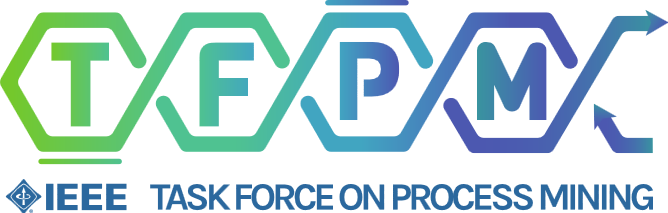

---
hide:
  - navigation
  - toc
  - nav
---

# SMA4PM - Streaming Management & Analytics for Process Mining

This workshop series aims at investigating streaming aspects within Process Mining.
Streaming Process Mining is an emerging area in process mining that spans data mining (e.g. stream data mining; mining time series; evolving graph mining), process mining (e.g. process discovery; conformance checking; predictive analytics; efficient mining of big log data; online feature selection; online outlier detection; concept drift detection; online recommender systems for processes), scalable big data solutions for process mining and the general scope of online event mining. In addition to many other techniques that are all gaining interest and importance in industry and academia.

The workshop is a satellite event of the IEEE Task Force on Process Mining.

The next edition of the [SMA4PM 2025](/2025) will take place in Montevideo, Uruguay together with [ICPM 2025](https://icpmconference.org/2025/).

## Previous editions

* [SMA4PM 2024](/2024) - Copenhagen, Denmark
* [SA4PM 2022](/2022) - Bolzano, Italy
* [SA4PM 2021](/2021) - Eindhoven, The Netherlands
* [SA4PM 2020](/2020) - Online

